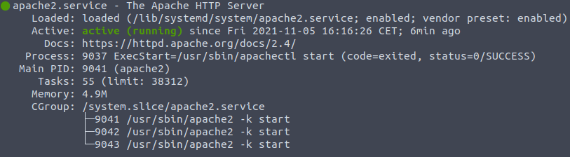

# Apache

# Indice
1. Introducción
    - 1.1 ¿Qué es apache?
    - 1.2 ¿Como funciona?
2. Instalación
    - 2.1 Instalar apache
    - 2.2 Configuración del cortafuegos
    - 2.3 Verificar estado web
3. Configuración de apache
4. Conclusión
5. Bibliografía

# 1. Introducción
**1.1 ¿Qué es apache?**

Apache es un servidor web HTTP de codígo abierto el cual está mantenido y desarrollado por la comunidad junto con Apache software fundación.

Apache es el servidor más usado, ya que posee un gran nivel de seguridad y estabilidad.

**1.2 ¿Como funciona?**

Apache proporciona a todos los usuarios los ficheros necesarios para que se puedan visualizar las webs desde los navegadores desde que se le hacen las solicitudes.

Las solicitudes llegan al servidor de Apache mediante el protocolo de HTTP el cual está encargado de mostrar la información al usuario.

La estructura de Apache esta basada en una serie de módulos los cuales permiten activar y desactivar una serie de funcionalidades y también nos permite ajustar los parámetros de PHP del hosting.

# 2. Instalación
**2.1 Instalar apache**

Para instalar apache en nuestro ordenador tendremos que ejecutar los siguientes comandos
> sudo apt update

> sudo apt install apache2

**2.2 Configuración del cortafuegos**

> sudo ufw app list

Aparecera el siguiente listado

> sudo ufw allow 'Apache'

Con esto ya tendremos habilitado el trafico de datos unicamente del puerto 80.

**2.3 Verificar el estado del servidor**

Para ver si apache esta en funcionamiento utilizaremos el siguiente comando:

> sudo systemctl status apache2

Para acceder a nuestra web utilizaremos el siguiente comando:

>hostname -l

Posteriormente escribiremos la direccón IP en nuestro navegador

Nos aparecera la pagina predeterminada de ubuntu.

# 3. Configuracón de apache
Primero crearemos una carpeta con el nombre ejemplo dentro de la ruta:

> sudo mkdir -p /var/www/ejemplo

Asignaremos al usuario como propietario:

> sudo chown -R $USER:$USER /var/www/ejemplo

Una vez accederemos mediante siguiente comando:

> cd /var/www/ejemplo

Una vez dentro, deberemos de crear el archivo index.html de la siguiente manera:

> nano index.html

Escribimos un codigo para el ejemplo:

Después nos dirigiremos a la ruta donde se encuentra ejemplo.conf para editarlo:

> cd /etc/apache2/sites-available/

Cuando accedamos a la ubicación le cambiamos el nombre a ejemplo.conf:

> cp 000-default.conf ejmplo.conf

Ahora para lo editamos con la instrucción nano.

Después iniciamos la configuración:

> a2ensite ejemplo.conf

Nos aparecera lo siguiente:

Para comprobar que no tenga errores ejecutamos el siguiente comando:

> sudo apache2ctl configtest

Por ultimo reiniciamos apache para que se apliquen los cambios.

> sudo systemctl restart apache2

# 4. Conclusión

Como conclusión Apache es una buena manera de almacenar nuestro servidor web, ya que es gratuito y con una comunidad de usuarios muy grande y nos puede proporcionar un alto nivel de seguridad puesto que recibe parches de seguridad constantemente lo cual lo hace atractivo al usuario.

# 5. Bibliografia
[www.digitalocean.com](https://www.digitalocean.com/community/tutorials/como-instalar-el-servidor-web-apache-en-ubuntu-18-04-es)

[www.dinahosting.com](https://dinahosting.com/ayuda/que-es-apache-y-para-que-sirve/)

[www.hostinger.com](https://www.hostinger.es/tutoriales/que-es-apache/)

[es.wikipedia.org](https://es.wikipedia.org/wiki/Servidor_HTTP_Apache)